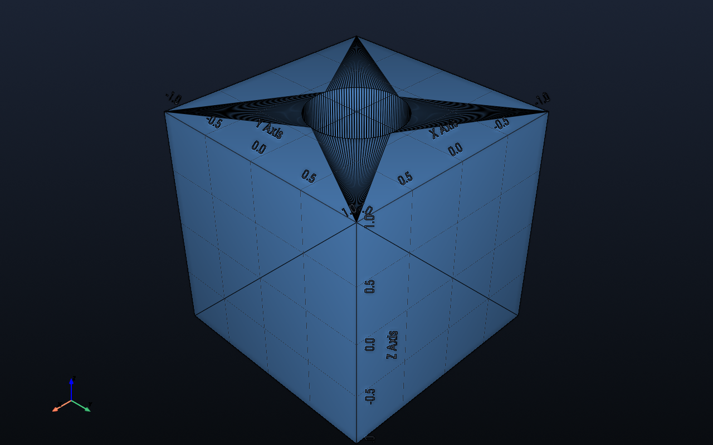
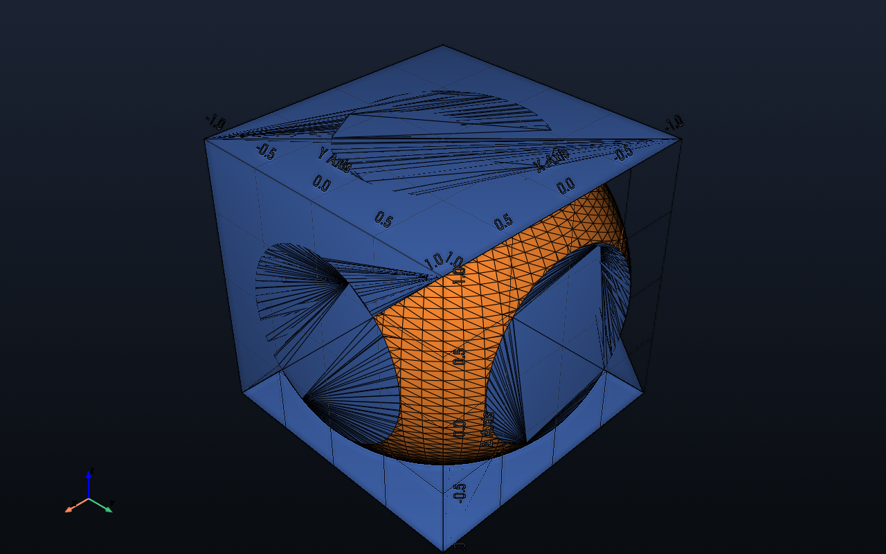

# Modeling — CSG Helpers

Imported from `impression.modeling`:

```python
from impression.modeling import boolean_union, boolean_difference, boolean_intersection, union_meshes
```

Booleans propagate per-object colors onto result faces. Union/intersection faces keep the originating mesh color; difference assigns new cut faces to the cutter’s color.
If no input colors are provided, the result uses the default preview color.

All helpers operate on internal triangle meshes and use `manifold3d` for robust, watertight-aware booleans.
Install requirement: `pip install manifold3d`.

## boolean_union(meshes, tolerance=1e-5)
- Combine two or more meshes into a single body.
- `meshes`: iterable of internal meshes (`Mesh`/`MeshGroup`).
- `tolerance`: reserved for future mesh hygiene tuning.
- Example: `docs/examples/csg/union_example.py` (blue box + orange cylinder)
- Preview: `impression preview docs/examples/csg/union_example.py`

```python
from impression.modeling import boolean_union, make_box, make_cylinder

def build():
    box = make_box(size=(2, 2, 1))
    cyl = make_cylinder(radius=0.6, height=1.5)
    return boolean_union([box, cyl])
```


You can also union a collection directly with `union_meshes`, which accepts either an iterable or a mapping (e.g., dict) of meshes:

```python
from impression.modeling import make_box, make_cylinder, union_meshes

def build():
    a = make_box(size=(2, 2, 1), color="#5A7BFF")
    b = make_cylinder(radius=0.8, height=1.5, color="#FF7A18")
    return union_meshes({"box": a, "cyl": b})
```

Example: `docs/examples/csg/union_meshes_example.py`

## boolean_difference(base, cutters, tolerance=1e-5)
- Subtract one or more cutter meshes from `base`.
- Example: `docs/examples/csg/difference_example.py`
- Preview: `impression preview docs/examples/csg/difference_example.py`

```python
from impression.modeling import boolean_difference, make_box, make_cylinder

def build():
    base = make_box(size=(2, 2, 2))
    cutter = make_cylinder(radius=0.4, height=2.5)
    return boolean_difference(base, [cutter])
```



## boolean_intersection(meshes, tolerance=1e-5)
- Keep only overlapping volume among provided meshes.
- Example: `docs/examples/csg/intersection_example.py`
- Preview: `impression preview docs/examples/csg/intersection_example.py`

```python
from impression.modeling import boolean_intersection, make_box, make_sphere

def build():
    box = make_box(size=(2, 2, 2))
    sphere = make_sphere(radius=1.2)
    return boolean_intersection([box, sphere])
```


