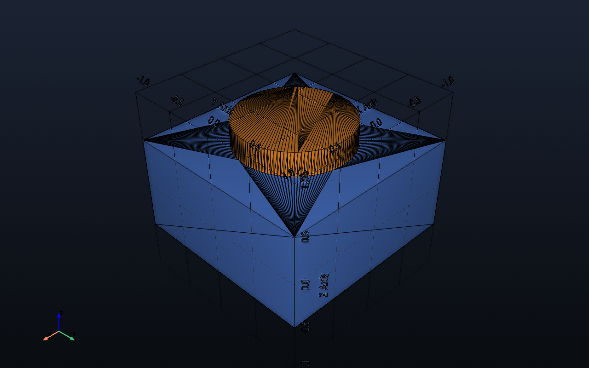
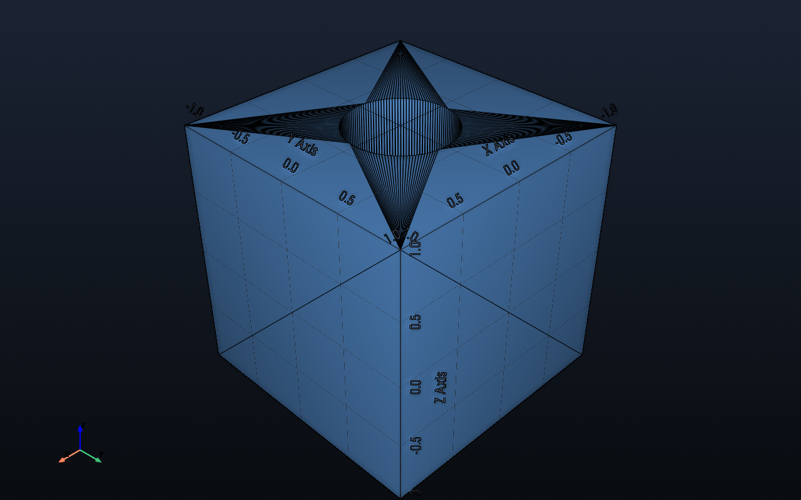
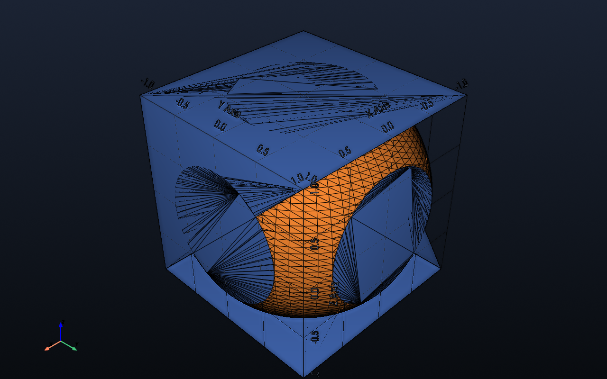

# Modeling — CSG Helpers

Imported from `impression.modeling`:

```python
from impression.modeling import boolean_union, boolean_difference, boolean_intersection, union_meshes
```

Booleans propagate per-object colors onto result faces. Union/intersection faces keep the originating mesh color; difference assigns new cut faces to the cutter’s color.
If no input colors are provided, the result uses the default preview color.

All helpers operate on internal triangle meshes and use `manifold3d` for robust, watertight-aware booleans.
Install requirement: `pip install manifold3d`.

## Surface-First Status

Surface-body booleans are still in migration, so the public boolean execution helpers remain mesh-primary for now. The surfaced work that is ready today is the canonical input-preparation layer:

```python
from impression.modeling import (
    make_box,
    prepare_surface_boolean_difference_operands,
    prepare_surface_boolean_operands,
    surface_boolean_overlap_fragments,
    surface_boolean_intersection_stage,
)

left = make_box(size=(1.0, 1.0, 1.0), backend="surface")
right = make_box(size=(1.0, 1.0, 1.0), center=(0.25, 0.0, 0.0), backend="surface")

prepared_union = prepare_surface_boolean_operands("union", [left, right])
prepared_difference = prepare_surface_boolean_difference_operands(left, [right])
intersection_stage = surface_boolean_intersection_stage(prepared_union)
overlap_fragments = surface_boolean_overlap_fragments(
    prepare_surface_boolean_operands("intersection", [left, right])
)
```

Current surfaced boolean eligibility rules are explicit and deterministic:

- operands must be `SurfaceBody` instances
- each operand must contain exactly one shell
- each shell must be connected
- each operand must be closed-valid under shell seam and boundary truth
- canonical preparation bakes attached transforms into patch geometry before later execution

This preparation layer exists so surfaced boolean execution can land on top of a stable input contract instead of silently falling back to mesh truth.

The first bounded execution helper is also available now:

- `surface_boolean_intersection_stage(...)`
- `surface_boolean_overlap_fragments(...)` for the current overlap-intersection box slice

That helper currently computes deterministic surfaced cut-curve and patch
classification records, including bounded split-selection records, for the
intentionally small initial scope:

- exactly two operands
- simple single-shell axis-aligned planar box-style operands without trims

More general surfaced boolean execution is still tracked by the remaining open
surface boolean execution leaves.

The public boolean helpers now also accept `backend="surface"` as an explicit migration boundary. Today that surfaced branch:

- validates and canonicalizes `SurfaceBody` operands
- can return a structured `SurfaceBooleanResult`
- runs supported reconstructed outputs through a deterministic surfaced validity gate with bounded cleanup
- never emits a legacy mesh deprecation warning
- succeeds for a very small bounded initial scope:
  - exact no-cut disjoint, touching, equal, and exact-containment cases in the current supported primitive families
  - `intersection` of simple overlapping axis-aligned box-style operands
  - `union` of simple overlapping axis-aligned box-style operands when the result stays a single connected orthogonal surfaced shell
  - `difference` of simple overlapping axis-aligned box-style operands when the result stays a single connected orthogonal surfaced shell
  - `union` of simple disjoint surfaced operands as a multi-shell surfaced result
  - `union` when one bounded supported surfaced operand exactly contains the other or both are equal
  - `difference` when the cutter is disjoint from the base, or fully removes it through an exact no-cut relation
- remains explicitly unsupported for broader surfaced boolean cases

That means callers can start moving onto the surfaced contract now without pretending the general surface boolean kernel is already finished.

Within that surfaced lane, result posture is now explicit across three caller-facing outcomes:

- `status="succeeded"` for accepted surfaced results
- `status="invalid"` when bounded cleanup cannot make a reconstructed surfaced result pass the validity gate
- `status="unsupported"` when the current surfaced execution slice does not implement the requested case yet

## Migration Posture

The public boolean APIs are now split into two explicit lanes:

- default mesh lane: returns executable mesh geometry today
- surfaced lane: `backend="surface"` returns `SurfaceBooleanResult`

The surfaced lane is the migration contract for downstream callers that want to stop depending on mesh-primary boolean truth. It is intentionally honest:

- surfaced inputs are validated and canonicalized
- surfaced results are explicit and structured
- supported reconstructed results get only bounded deterministic cleanup such as duplicate seam-use removal and canonical ordering
- invalid surfaced reconstruction remains explicit instead of silently falling back to mesh
- unsupported execution stays surfaced and does not fall back to mesh
- legacy mesh deprecation posture remains in place for the executable mesh lane

If you need renderable boolean output today, keep using the default mesh lane. If you are migrating consumers or tests onto the surface-first contract, use `backend="surface"` and inspect the returned `SurfaceBooleanResult`.

## Reference Readiness

The surfaced CSG reference program has two representative overlap-evidence
fixtures active today:

- `surfacebody/csg_union_box_post`
- `surfacebody/csg_difference_slot`

Those active overlap fixtures carry:

- dirty and clean reference images
- dirty and clean reference STL files
- triptych-style operand/result presentation so operand A, result, and operand
  B stay visible in one deterministic render
- canonical slice artifacts with an asymmetric edge-protrusion cue so rotated
  section truth fails clearly

The still-open initial matrix also includes:

- `surfacebody/csg_intersection_box_sphere`

That named intersection entry remains part of the required surfaced CSG
promotion matrix, but it is still open because the bounded surfaced execution
lane does not yet own a meaningful partial-overlap box/sphere result.

Orientation-sensitive fixtures may carry canonical slice artifacts:

- expected section bitmap
- recovered section bitmap
- visual diff bitmap

Those slice checks classify whether the recovered section is the same shape with
the same orientation, the same shape but rotated, or a different shape.

## boolean_union(meshes, tolerance=1e-4)
- Combine two or more meshes into a single body.
- `meshes`: iterable of internal meshes (`Mesh`/`MeshGroup`).
- `tolerance`: reserved for future mesh hygiene tuning.
- Example: `docs/examples/csg/union_example.py` (blue box + orange cylinder)
- Preview: `impression preview docs/examples/csg/union_example.py`

```python
from impression.modeling import boolean_union, make_box, make_cylinder

def build():
    box = make_box(size=(2, 2, 1))
    cyl = make_cylinder(radius=0.6, height=1.5)
    return boolean_union([box, cyl])
```



You can also union a collection directly with `union_meshes`, which accepts either an iterable or a mapping (e.g., dict) of meshes:

```python
from impression.modeling import make_box, make_cylinder, union_meshes

def build():
    a = make_box(size=(2, 2, 1), color="#5A7BFF")
    b = make_cylinder(radius=0.8, height=1.5, color="#FF7A18")
    return union_meshes({"box": a, "cyl": b})
```

Example: `docs/examples/csg/union_meshes_example.py`

`union_meshes(...)` is retained as an explicit standalone mesh tool. It is
useful for analysis, repair, and debugging workflows, but it should not be read
as canonical surfaced modeling truth.

## boolean_difference(base, cutters, tolerance=1e-4)
- Subtract one or more cutter meshes from `base`.
- Example: `docs/examples/csg/difference_example.py`
- Preview: `impression preview docs/examples/csg/difference_example.py`

```python
from impression.modeling import boolean_difference, make_box, make_cylinder

def build():
    base = make_box(size=(2, 2, 2))
    cutter = make_cylinder(radius=0.4, height=2.5)
    return boolean_difference(base, [cutter])
```



## boolean_intersection(meshes, tolerance=1e-4)
- Keep only overlapping volume among provided meshes.
- Example: `docs/examples/csg/intersection_example.py`
- Preview: `impression preview docs/examples/csg/intersection_example.py`

```python
from impression.modeling import boolean_intersection, make_box, make_sphere

def build():
    box = make_box(size=(2, 2, 2))
    sphere = make_sphere(radius=1.2)
    return boolean_intersection([box, sphere])
```


