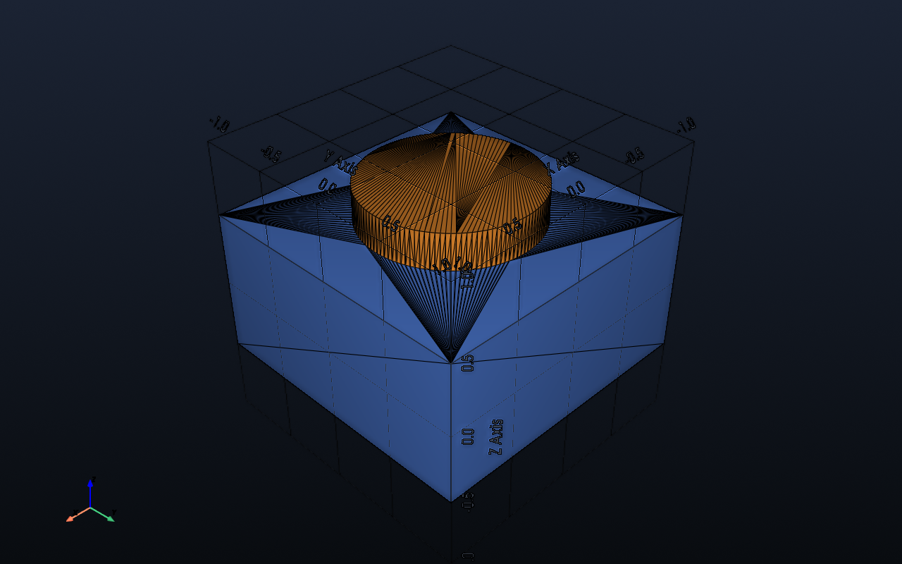
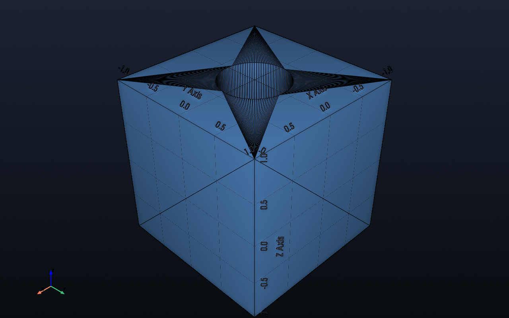
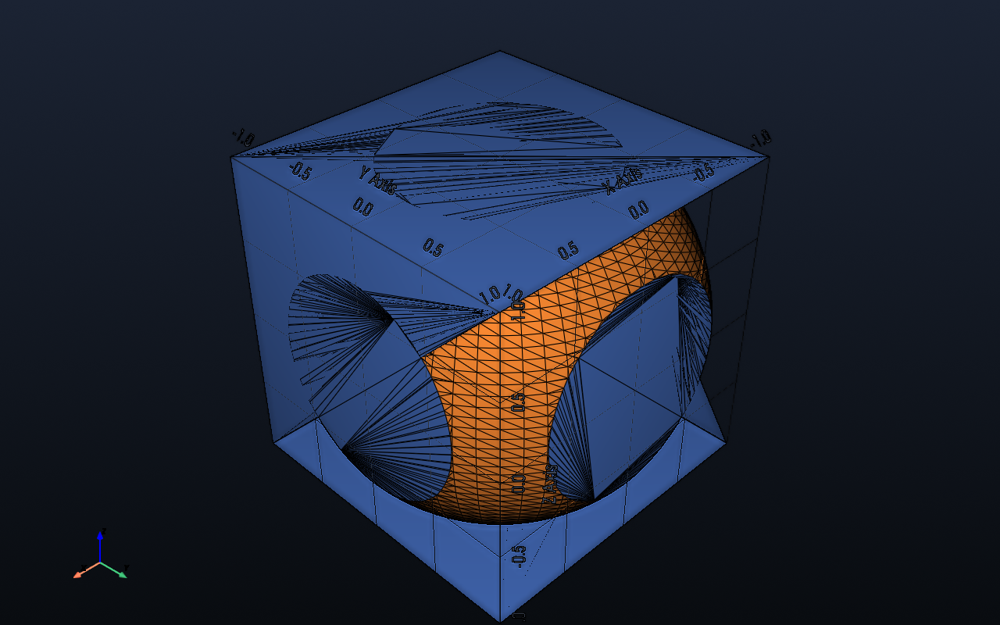

# Modeling — Surface Booleans

Impression's public modeling booleans operate on `SurfaceBody` geometry. They
never accept triangle meshes as modeling operands and never convert meshes back
into surface truth.

```python
from impression.modeling import (
    SurfaceBooleanResult,
    boolean_difference,
    boolean_intersection,
    boolean_union,
    make_box,
)
```

All three functions return `SurfaceBooleanResult`. Inspect the result before
passing its body to preview, export, or another modeling operation:

```python
result = boolean_union(
    [
        make_box(size=(2, 2, 1), center=(-0.5, 0, 0)),
        make_box(size=(2, 2, 1), center=(0.5, 0, 0)),
    ]
)

if result.status != "succeeded" or result.body is None:
    raise RuntimeError(result.failure_reason or "Surface union did not produce a body.")

body = result.body
```

This explicit envelope keeps unsupported geometry, invalid reconstruction, and
valid no-cut outcomes distinct from successful changed geometry.

## Public Contract

```text
boolean_union(bodies: Iterable[SurfaceBody], tolerance: float = 1e-4) -> SurfaceBooleanResult
boolean_difference(base: SurfaceBody, cutters: Iterable[SurfaceBody], tolerance: float = 1e-4) -> SurfaceBooleanResult
boolean_intersection(bodies: Iterable[SurfaceBody], tolerance: float = 1e-4) -> SurfaceBooleanResult
```

The operand collection is named `bodies`, not `meshes`. Runtime validation
happens before CSG family selection or kernel dispatch. Passing `Mesh`,
`MeshGroup`, or a mixed collection raises `TypeError` and points to the separate
mesh-tool namespace.

Every surfaced operand must be closed-valid. Preparation bakes attached
transforms into patch geometry and preserves the structured evidence used by
the execution and validity gates.

## Result Statuses

- `succeeded`: the operation produced an accepted surfaced result.
- `no-cut`: a difference was proven disjoint and retains the unchanged closed
  base honestly.
- `invalid`: the candidate contradicted the public result contract or failed
  closure, seam, operand-witness, or change validation.
- `unsupported`: the exact surface kernel does not implement the requested
  geometry family or topology.

Successful results provide `result.body`. Invalid and unsupported results do
not expose partial geometry. Surface difference additionally publishes
normalized geometry-change evidence and a public success-gate decision so an
unchanged interacting result cannot be mislabeled as success.

## `boolean_union(bodies, tolerance=1e-4)`

Combine two or more closed surface bodies. Supported coincident-contact routes
remove interior faces and validate the reconstructed shell before returning
success.

```python
from impression.modeling import boolean_union, make_box


def build():
    left = make_box(size=(2, 2, 1), center=(-0.5, 0, 0))
    right = make_box(size=(2, 2, 1), center=(0.5, 0, 0))
    result = boolean_union([left, right])
    if result.status != "succeeded" or result.body is None:
        raise RuntimeError(result.failure_reason or "Surface union failed.")
    return result.body
```

Example: `docs/examples/csg/union_example.py`



## `boolean_difference(base, cutters, tolerance=1e-4)`

Subtract one or more closed surface cutters from a closed surface base.
Successful interacting results must contain a real reconstructed cut and pass
the shared difference success gate.

```python
from impression.modeling import boolean_difference, make_box


def build():
    base = make_box(size=(3, 2, 2))
    cutter = make_box(size=(1.5, 1, 3), center=(1, 0, 0))
    result = boolean_difference(base, [cutter])
    if result.status not in {"succeeded", "no-cut"} or result.body is None:
        raise RuntimeError(result.failure_reason or "Surface difference failed.")
    return result.body
```

Example: `docs/examples/csg/difference_example.py`



## `boolean_intersection(bodies, tolerance=1e-4)`

Keep only the shared volume of two or more closed surface bodies.

```python
from impression.modeling import boolean_intersection, make_box


def build():
    left = make_box(size=(2, 2, 2), center=(-0.5, 0, 0))
    right = make_box(size=(2, 2, 2), center=(0.5, 0, 0))
    result = boolean_intersection([left, right])
    if result.status != "succeeded" or result.body is None:
        raise RuntimeError(result.failure_reason or "Surface intersection failed.")
    return result.body
```

Example: `docs/examples/csg/intersection_example.py`



## Preview And Export

Model modules should return the accepted `SurfaceBody`, not the result envelope.
The preview and export commands tessellate that surface only at their consumer
boundary:

```bash
impression preview docs/examples/csg/union_example.py
impression export docs/examples/csg/union_example.py --output dist/union.stl --overwrite
```

Code that needs a mesh directly can use
`tessellate_surface_body(body, export_tessellation_request())` after the boolean
result has succeeded.

## Explicit Mesh Tools

Meshes remain useful for downstream analysis, repair, debugging, and terminal
interchange. Those operations live in `impression.modeling.mesh_tools`, outside
the public modeling boolean API:

```python
from impression.modeling import make_box_mesh, make_cylinder_mesh
from impression.modeling.mesh_tools import union_meshes


mesh = union_meshes(
    {
        "box": make_box_mesh(size=(2, 2, 1)),
        "cylinder": make_cylinder_mesh(radius=0.8, height=1.5),
    }
)
```

`union_meshes(...)` is retained as an explicit standalone mesh tool. It is not
canonical surfaced modeling truth and is intentionally absent from the
top-level `impression.modeling` export table.

Example: `docs/examples/csg/union_meshes_example.py`

## Current Exact Scope

The surface kernel supports bounded exact routes, including:

- disjoint, touching, equal, and containment classifications for supported
  primitive families;
- overlapping axis-aligned box union, difference, and intersection;
- coplanar loft-body contact union with interior-patch removal;
- exact rectangular-loft/orthogonal-box difference reconstruction;
- explicit structured refusal for unsupported higher-order or underconstrained
  topology.

Unsupported execution remains surfaced and does not fall back to mesh. Accepted
reconstructed bodies pass deterministic seam, adjacency, closure, provenance,
and operand-witness validation.

## Reference Readiness

The surfaced CSG reference program includes:

- `surfacebody/csg_union_box_post`
- `surfacebody/csg_difference_slot`
- `surfacebody/csg_intersection_box_sphere`

Reference cases carry dirty and clean reference images, dirty and clean
reference STL files, and triptych-style operand/result presentation. Canonical
slice artifacts use an asymmetric edge-protrusion cue and compare the expected
section bitmap, recovered section bitmap, and visual diff bitmap, distinguishing
the same shape from the same shape but rotated.
