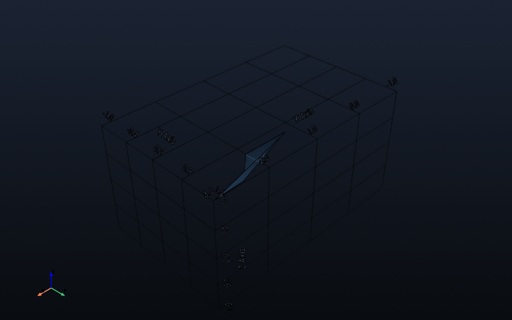

# Modeling — Paths

`Path` encapsulates polyline/spline utilities for sweeps and sampling.

```python
from impression.modeling import Path
```

## Creating Paths

- `Path.from_points(points, closed=False)` — build from a list of XYZ coordinates. Closed paths automatically connect last point to first.

## Methods

- `length()` — total arc length.
- `sample(n_points)` — evenly spaced samples along the path (NumPy array).
- `to_polyline()` — returns a PyVista polyline for quick visualization.
- `to_spline(n_samples=200)` — converts to a smooth PyVista spline.

Example file: `docs/examples/paths/path_example.py`

- Preview: `impression preview docs/examples/paths/path_example.py`

```python
from impression.modeling import Path

def build():
    path = Path.from_points(
        [
            (0, 0, 0),
            (1, 0, 0),
            (2, 1, 0.5),
            (3, 1.5, 1.0),
        ],
        closed=False,
    )
    return path.to_polyline()
```


