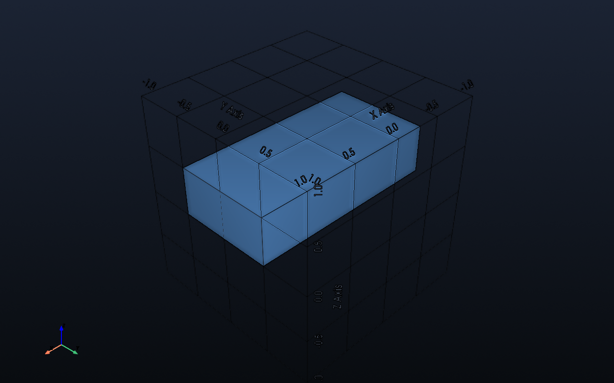
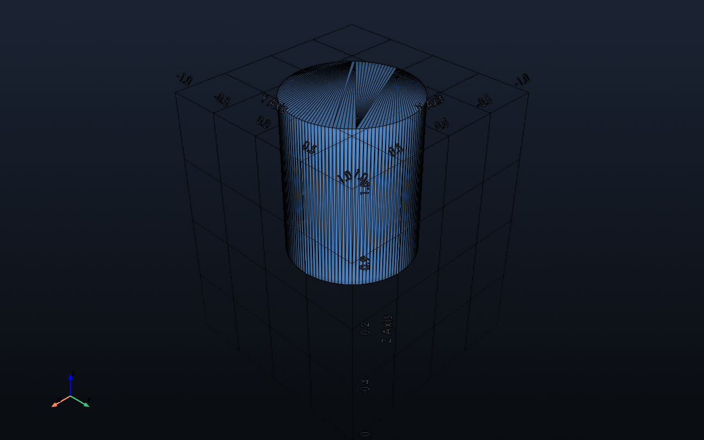
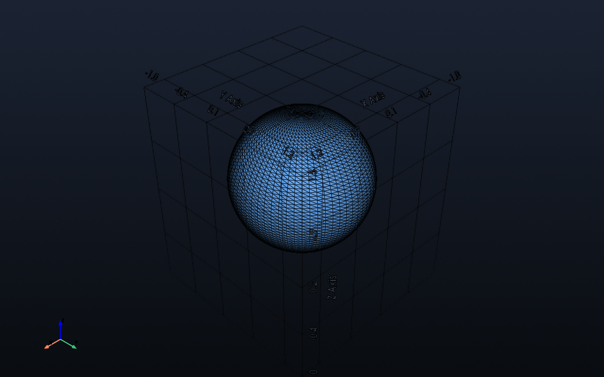
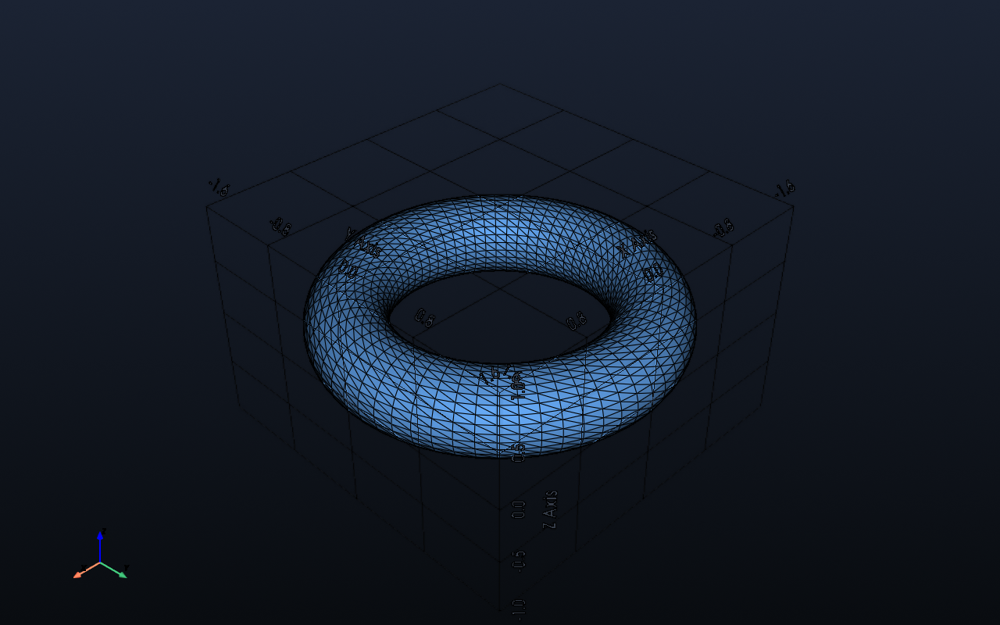
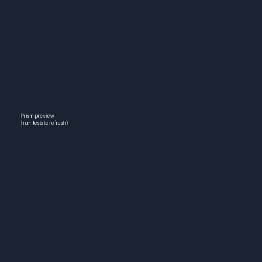

# Modeling — Primitives

All primitives are exposed from `impression.modeling` and currently use PyVista meshes under the hood. Import helpers like:

```python
from impression.modeling import make_box, make_cylinder, make_sphere, make_torus
```

> Rendering note: the CLI preview (`impression preview`) or `docs/examples/...` scripts can be used to visualize outputs on a desktop environment.

## Box

- **Function:** `make_box(size=(dx, dy, dz), center=(0, 0, 0))`
- **Options**
  - `size`: tuple specifying side lengths along X/Y/Z.
  - `center`: world-space center of the box.
- **Example:** `docs/examples/primitives/box_example.py`
- **Preview:** `impression preview docs/examples/primitives/box_example.py`

```python
from impression.modeling import make_box

def build():
    return make_box(size=(2.0, 1.0, 0.5), center=(0.0, 0.0, 0.25))
```



## Cylinder

- **Function:** `make_cylinder(radius=0.5, height=1.0, center=(0,0,0), direction=(0,0,1), resolution=128)`
- **Options**
  - `radius` / `height`
  - `direction`: normalized axis vector.
  - `resolution`: number of segments around the circumference.
- **Example:** `docs/examples/primitives/cylinder_example.py`
- **Preview:** `impression preview docs/examples/primitives/cylinder_example.py`

```python
from impression.modeling import make_cylinder

def build():
    return make_cylinder(radius=0.6, height=1.5, center=(0, 0, 0.75))
```



## Sphere

- **Function:** `make_sphere(radius=0.5, center=(0,0,0), theta_resolution=64, phi_resolution=64)`
- **Options:** radius, center, longitudinal (`theta_resolution`) and latitudinal (`phi_resolution`) segment counts.
- **Example:** `docs/examples/primitives/sphere_example.py`
- **Preview:** `impression preview docs/examples/primitives/sphere_example.py`

```python
from impression.modeling import make_sphere

def build():
    return make_sphere(radius=0.75, center=(0.5, 0.5, 0.75))
```



## Torus

- **Function:** `make_torus(major_radius=1.0, minor_radius=0.25, center=(0,0,0), direction=(0,0,1), n_theta=64, n_phi=32)`
- **Options**
  - `major_radius`: distance from center to tube centerline.
  - `minor_radius`: tube radius.
  - `direction`: orientation axis.
  - `n_theta` / `n_phi`: angular resolutions.
- **Example:** `docs/examples/primitives/torus_example.py`
- **Preview:** `impression preview docs/examples/primitives/torus_example.py`

```python
from impression.modeling import make_torus

def build():
    return make_torus(major_radius=1.25, minor_radius=0.35, center=(0, 0, 0))
```



## Cone / Circular Frustum

- **Function:** `make_cone(bottom_diameter=1.0, top_diameter=0.0, height=1.0, ...)`
- Supports classic cones (`top_diameter=0`) or truncated frustums.
- **Example:** `docs/examples/primitives/cone_example.py`
- **Preview:** `impression preview docs/examples/primitives/cone_example.py`

```python
from impression.modeling import make_cone

def build():
    return make_cone(bottom_diameter=1.5, top_diameter=0.4, height=2.0)
```


## Prism / Pyramid

- **Function:** `make_prism(base_size=(dx, dy), top_size=None, height=1.0, ...)`
- `top_size=None` → straight prism, `top_size=(0,0)` → pyramid.
- **Example:** `docs/examples/primitives/prism_example.py`
- **Preview:** `impression preview docs/examples/primitives/prism_example.py`

```python
from impression.modeling import make_prism

def build():
    return make_prism(base_size=(1.5, 1.0), top_size=(0.3, 0.6), height=1.8)
```


